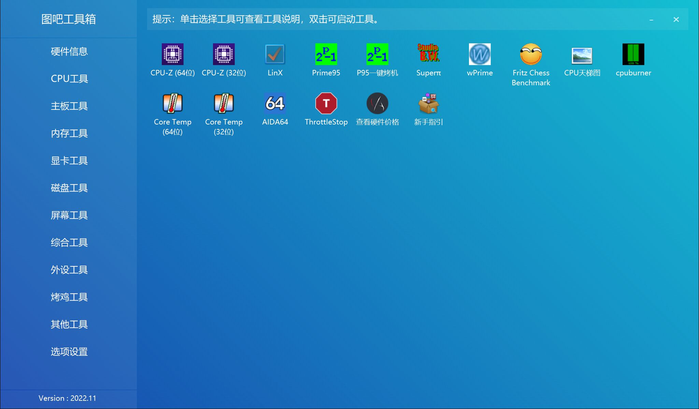

/图吧工具箱
/DIY爱好者的必备工具集合

## 图拉丁吧工具箱  
### [官方网站](https://www.tbtool.cn/)  
[本地下载](https://rr.855955.xyz/tbtool202502.exe)  

图吧工具箱，是开源、免费、绿色、纯净的硬件检测工具合集，专为所有计算机硬件极客、DIY爱好者、各路大神及小白制作。集成大量常见硬件检测、评分工具，一键下载、方便使用。

专业 · 专注于收集各种硬件检测、评分、测试工具，常见工具均有收集。

纯净 · 无任何捆绑强制安装行为，不写入注册表，没有任何敏感目录及文件操作，无任何诱导、孔吓、欺乍等操作。

绿色 · 提供7z压缩包，无需安装、注册等复杂操作，解压即可使用。用完可直接删除，无需卸载。

开放 · 群文件可直接下载源码，并提供硬件检测SDK，主流编程语言无门槛调用，且无需授权、免费使用无任何限制。

不忘初心，始于2014，持续10年稳定更新，坚持做能方便大家使用的硬件检测工具箱。  
