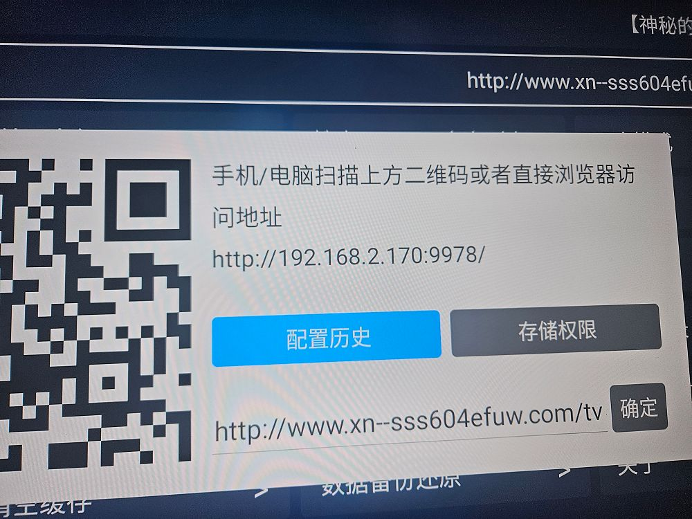

TVbox
安卓电视上免费无广的看剧软件

## 地址
<https://tvbox.clbug.com>  
<https://github.com/o0HalfLife0o/TVBoxOSC/releases>  
<https://github.com/cyao2q/files>  

[123云盘](https://www.123684.com/s/4wHDVv-b8Bq3?提取码:mBrt)
提取码`mBrt`  

本地下载  
[手机版](https://rr.855955.xyz/OK影视手机版.apk)  
[电视版](https://rr.855955.xyz/TVBox电视版.apk)  

## 使用方法  
把安装包存到U盘插入电视上安装  
安装完后还要配置接口才能使用  
### 1.打开设置  
  
### 2.配置地址  
  
### 3.用手机打开电视上的地址  
  
### 4.手机上配置接口  
#### 先点击右下的设置，输入，确认。  
个人使用的接口`http://www.xn--sss604efuw.com/tv`  
  
### 5.电视上出现了你输入的接口，点确定，ok完成。
